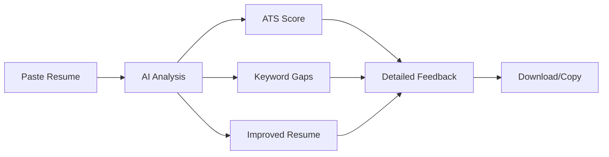

<div align="center">


# 🚀 ResumePro

### AI-Powered ATS Resume Analyzer

**Transform your resume into an interview magnet with enterprise-grade ATS optimization**

[](https://reactjs.org/)
[](https://www.typescriptlang.org/)
[](https://tailwindcss.com/)
[](https://opensource.org/licenses/MIT)

[Features](#-features) • [Demo](#-demo) • [Installation](#-installation) • [Tech Stack](#-tech-stack) • [Contributing](#-contributing)

</div>

---

## ✨ Features

<table>
<tr>
<td width="50%">

### 🎯 **Job-Specific Matching**
Match your resume against any job description with our enterprise ATS engine. Get precise scoring based on keyword alignment, skills match, and experience relevance.

### 📊 **Comprehensive Scoring**
- **40%** Keyword Match
- **25%** Skills Alignment  
- **20%** Experience Relevance
- **10%** ATS-Friendly Formatting
- **5%** Quantified Achievements

</td>
<td width="50%">

### 🤖 **AI-Powered Optimization**
Get an instantly improved version of your resume with:
- ✅ Job-specific keyword integration
- ✅ Professional action verbs
- ✅ Quantified achievements
- ✅ ATS-optimized formatting
- ✅ Grammar-perfect content

### 🔒 **100% Private**
All processing happens in your browser. Your resume never leaves your device.

</td>
</tr>
</table>

---

## 🎬 Demo

### Before & After

```diff
- Generic Resume (Score: 35/100)
+ Optimized Resume (Score: 82/100)

- "Worked on web development projects"
+ "Developed 5+ responsive web applications using React.js and Node.js, 
  improving user engagement by 40% and serving 10,000+ active users"
```

### Score Categories

| Score Range | Category | What It Means |
|-------------|----------|---------------|
| 🟢 **90-100** | Excellent Fit | Perfect match for the job |
| 🟢 **75-89** | Strong Fit | Most requirements met |
| 🟡 **60-74** | Moderate Fit | Some gaps to address |
| 🟠 **45-59** | Weak Fit | Significant improvements needed |
| 🔴 **0-44** | Poor Fit | Major overhaul required |

---

## 🚀 Installation

### Prerequisites

- **Node.js** (v16 or higher)
- **npm** or **yarn**

### Quick Start

```bash
# 1. Clone the repository
git clone https://github.com/yourusername/resumepro.git

# 2. Navigate to project directory
cd resumepro

# 3. Install dependencies
npm install

# 4. Start development server
npm run dev
```

🎉 **That's it!** Open [http://localhost:5173](http://localhost:5173) in your browser.

---

## 🛠️ Tech Stack

<div align="center">

| Category | Technologies |
|----------|-------------|
| **Frontend** | React 18, TypeScript, Vite |
| **UI Framework** | Tailwind CSS, shadcn/ui, Radix UI |
| **Animations** | Framer Motion |
| **AI Integration** | ChatGPT 3.5 API |
| **State Management** | React Query (TanStack Query) |
| **PDF Generation** | jsPDF |
| **Code Quality** | ESLint, TypeScript |

</div>

---

## 📁 Project Structure

```
resumepro/
├── 📂 public/              # Static assets (logo, favicon)
├── 📂 src/
│   ├── 📂 components/      # React components
│   │   ├── 📂 ui/          # shadcn/ui components
│   │   ├── ScoreMeter.tsx
│   │   ├── ResumeComparison.tsx
│   │   └── ...
│   ├── 📂 lib/             # Utilities & AI logic
│   │   └── resumeAnalyzer.ts
│   ├── 📂 pages/           # Page components
│   │   └── Index.tsx
│   └── index.css           # Global styles
├── index.html              # Entry point
├── package.json            # Dependencies
└── README.md               # You are here!
```

---

## 🎨 Key Features Breakdown

### 1️⃣ **Enterprise ATS Engine**
Our scoring system mimics real Applicant Tracking Systems used by Fortune 500 companies:
- Keyword extraction and matching
- Skills gap analysis
- Experience relevance scoring
- Formatting compatibility check

### 2️⃣ **Intelligent Resume Optimization**
The AI doesn't just suggest changes—it rewrites your resume:
- Transforms vague statements into quantified achievements
- Incorporates job-specific keywords naturally
- Maintains 100% honesty (no fake information)
- Ensures perfect grammar and professional tone

### 3️⃣ **Cover Letter Generator**
Generate tailored cover letters that complement your optimized resume.

### 4️⃣ **Real-time Feedback**
Get instant, actionable feedback:
- Missing keywords highlighted
- Weak sections identified
- Specific improvement suggestions
- Before/after comparison

---

## 📊 How It Works



1. **Input**: Paste your resume and optionally a job description
2. **Analysis**: AI analyzes using enterprise ATS criteria
3. **Scoring**: Get a detailed breakdown (0-100 score)
4. **Optimization**: Receive an improved, job-tailored version
5. **Export**: Download as PDF or copy to clipboard

---

## 🔧 Available Scripts

| Command | Description |
|---------|-------------|
| `npm run dev` | Start development server |
| `npm run build` | Build for production |
| `npm run preview` | Preview production build |
| `npm run lint` | Run ESLint |

---

## 🌐 Deployment

### Build for Production

```bash
npm run build
```

The optimized files will be in the `dist/` directory.

### Deploy to Vercel (Recommended)

[](https://vercel.com/new/clone?repository-url=https://github.com/yourusername/resumepro)

### Other Platforms

- **Netlify**: Drag & drop the `dist` folder
- **GitHub Pages**: Use `gh-pages` package
- **AWS S3**: Upload `dist` folder to S3 bucket

---

## 🤝 Contributing

Contributions are welcome! Here's how you can help:

1. 🍴 Fork the repository
2. 🌿 Create a feature branch (`git checkout -b feature/AmazingFeature`)
3. 💾 Commit your changes (`git commit -m 'Add some AmazingFeature'`)
4. 📤 Push to the branch (`git push origin feature/AmazingFeature`)
5. 🔃 Open a Pull Request

---

## 📝 License

This project is licensed under the **MIT License** - see the [LICENSE](LICENSE) file for details.

---

## 🙏 Acknowledgments

- **shadcn/ui** for beautiful UI components
- **Radix UI** for accessible primitives
- **Tailwind CSS** for utility-first styling
- **OpenAI** for ChatGPT API
- **Framer Motion** for smooth animations

---

## 📧 Contact & Support

- 🐛 **Bug Reports**: [Open an issue](https://github.com/yourusername/resumepro/issues)
- 💡 **Feature Requests**: [Start a discussion](https://github.com/yourusername/resumepro/discussions)
- 📧 **Email**: support@resumepro.com

---

<div align="center">

### ⭐ Star this repo if you found it helpful!

**Made with ❤️ for job seekers worldwide**

[⬆ Back to Top](#-resumepro)

</div>
